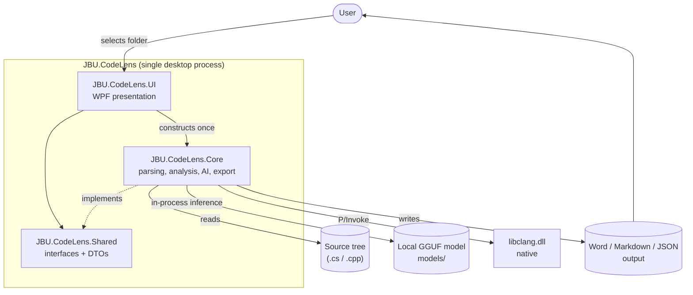
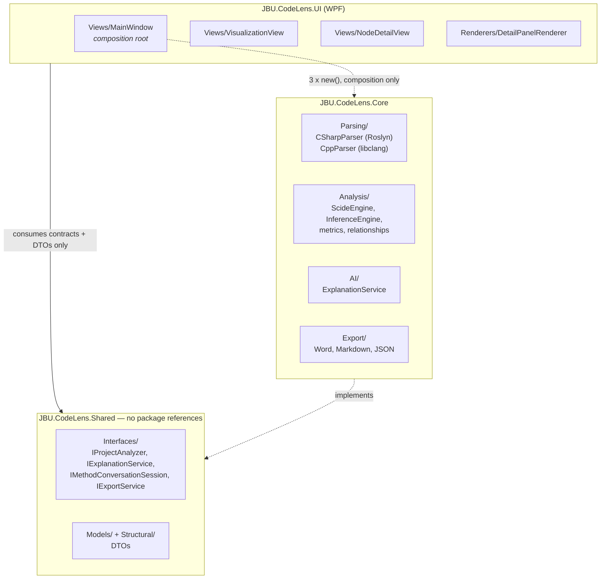
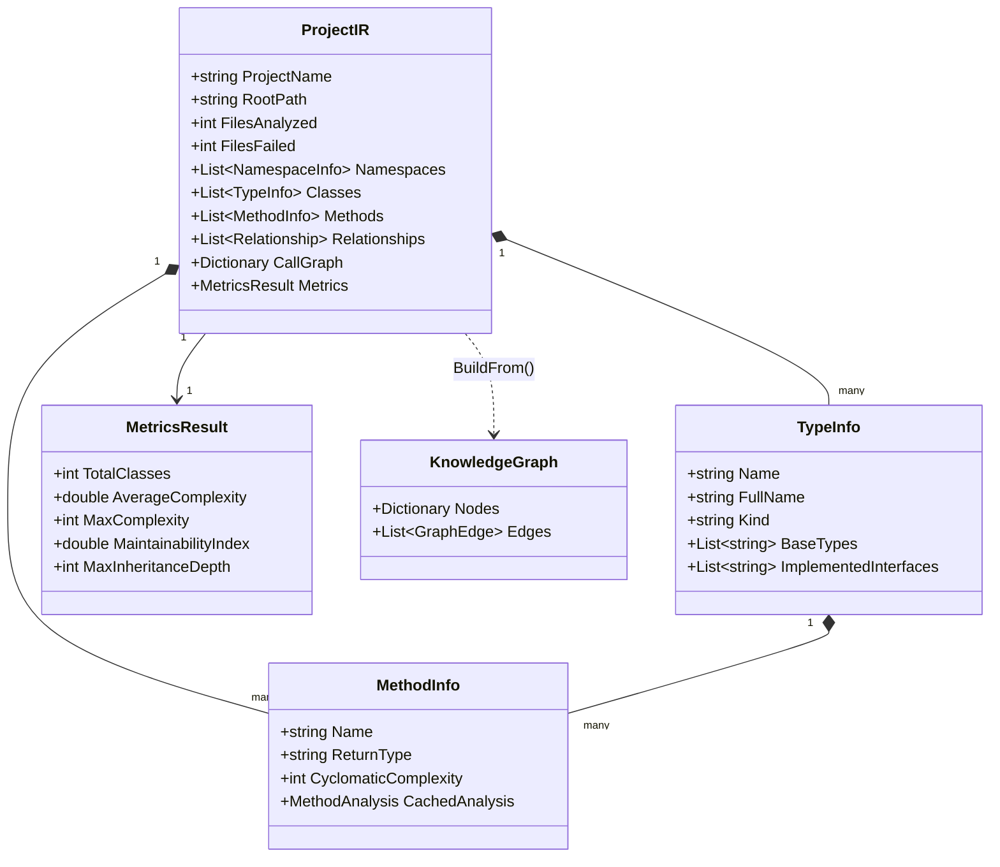
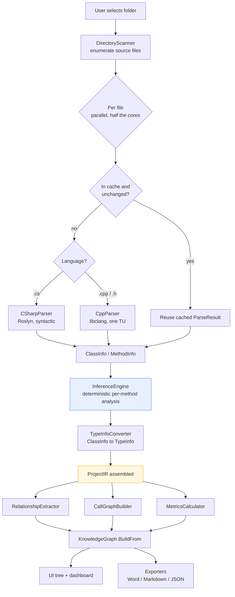
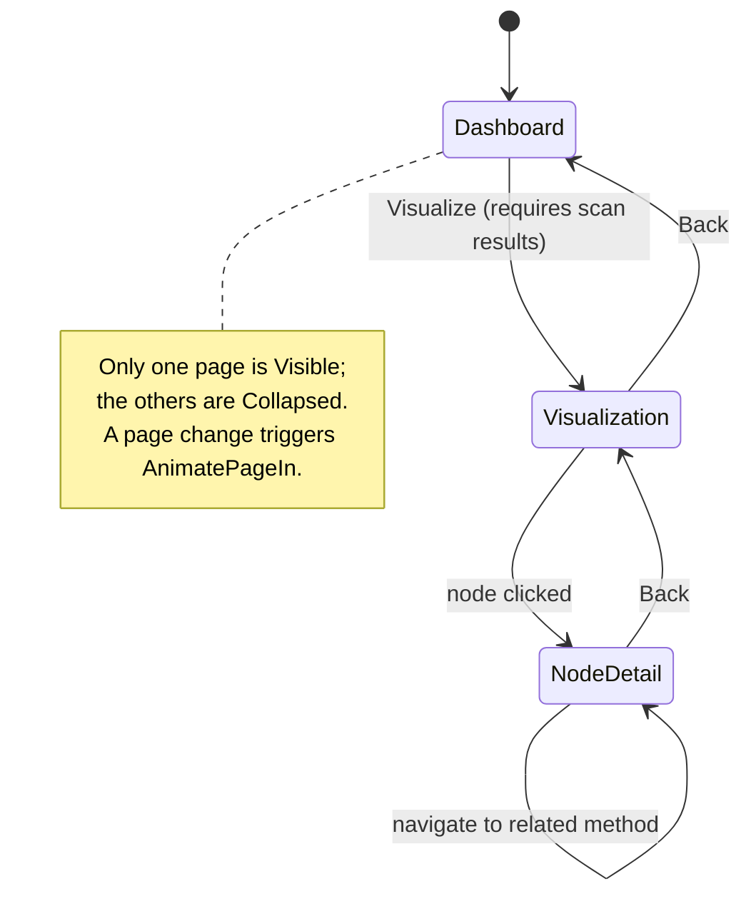
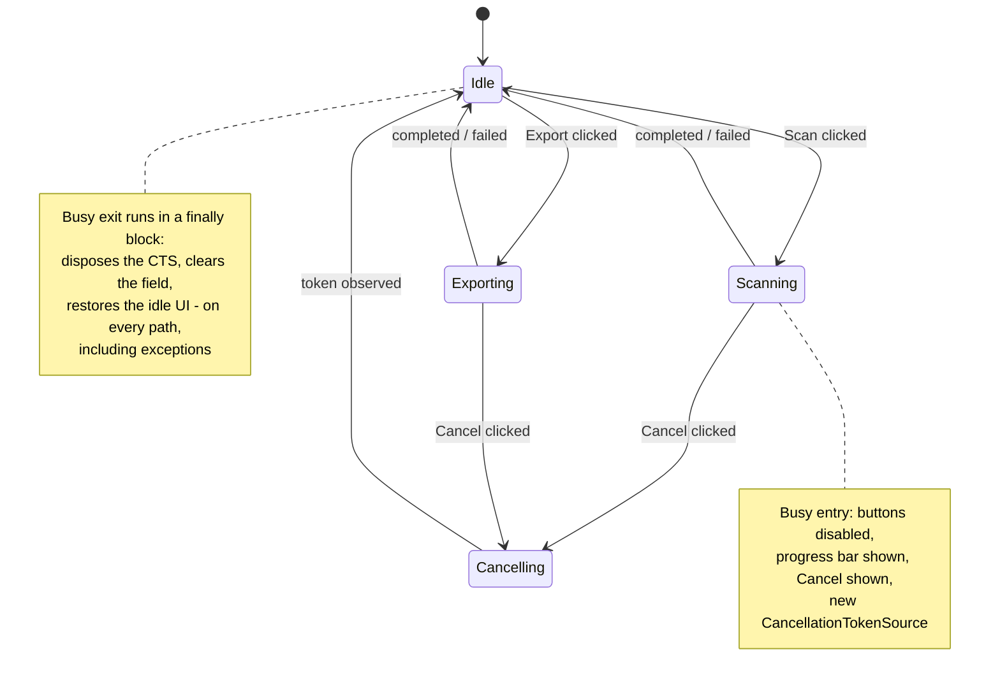
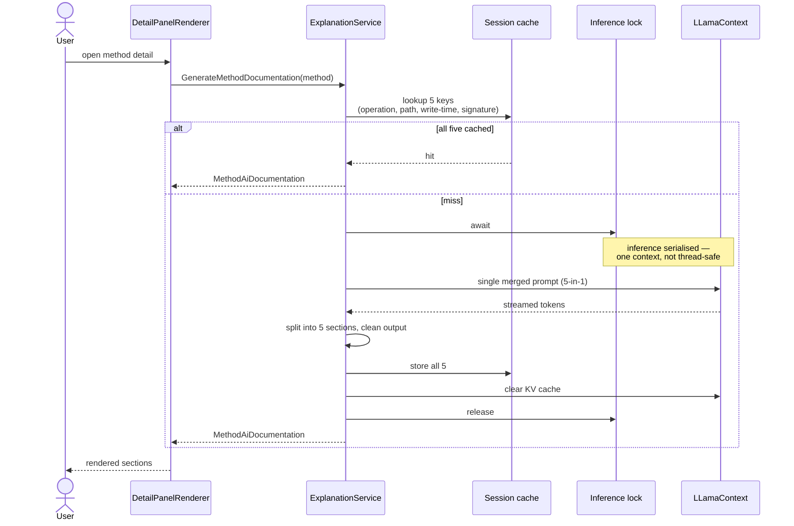

# Software Design Document — JBU.CodeLens

**Document version:** 1.0
**Date:** 2026-07-25
**Structure:** IEEE 1016 (Software Design Description)

---

## 1. Introduction

### 1.1 Purpose

This document describes the design of **JBU.CodeLens**, a Windows desktop application that analyses
a C# or C++ source tree and produces structural, deterministic and AI-assisted documentation of it.
It is written for reviewers and maintainers, and describes the system as built.

### 1.2 Scope

JBU.CodeLens takes a folder of source code as input and produces:

- a navigable structural view of namespaces, types, methods, fields and properties;
- derived project-wide data: relationships, a call graph, and complexity/maintainability metrics;
- deterministic per-method analysis (preconditions, postconditions, execution steps, design
  constraints, runtime risks) inferred without any language model;
- optional natural-language explanations generated by a local, on-device model;
- exported documentation in Word, Markdown and JSON.

All analysis is local. No source code leaves the machine.

### 1.3 Definitions

| Term | Meaning |
| --- | --- |
| **IR** | Intermediate Representation — the project-wide `ProjectIR` structure built once per scan |
| **ScideEngine** | The scan orchestrator; the implementation of `IProjectAnalyzer` |
| **Deterministic analysis** | Per-method inference derived from the parse tree only, with no model involved |
| **TU** | Translation unit — one libclang parse of one C++ file |
| **GGUF** | The quantised model file format used by LLamaSharp |

### 1.4 References

- [Architecture.md](../architecture/Architecture.md) — layer and dependency detail
- [ProjectIR.md](../architecture/ProjectIR.md), [Parser.md](../architecture/Parser.md),
  [LLM.md](../architecture/LLM.md), [Exporter.md](../architecture/Exporter.md)
- [WarningRemediation.md](../quality/WarningRemediation.md),
  [AssertionPolicy.md](../quality/AssertionPolicy.md),
  [StaticAnalysis.md](../quality/StaticAnalysis.md) — quality work items

---

## 2. System context

**Design intent.** Everything runs in one process on the user's machine, including model inference.
There is no server, no network call and no telemetry — a deliberate constraint, since the input is
source code the user may not be free to transmit.

---

## 3. Architectural design

### 3.1 Layering

### 3.2 Dependency rules

These are the invariants the architecture rests on:

1. **UI depends on `Shared` only.** All behaviour is reached through the four interfaces; all data
   through the DTOs. `Views/MainWindow.xaml.cs` is the *single* file permitted to name Core
   concrete types, and only to construct them (three `new` expressions). Every other UI file
   compiles against `Shared` alone.
2. **Core never references UI.** Neither Core nor Shared references `PresentationFramework` or
   `WindowsBase`, so the analysis engine is headless and independently testable.
3. **`Shared` has no package references at all.** `MethodInfo.SyntaxNode` is typed `object?`
   specifically so that Shared carries no Roslyn dependency; Core casts it back to
   `MethodDeclarationSyntax` where required.

> **Design note.** Rule 1 is enforced by convention, and a static-analysis rule (CA1859) actively
> pushes against it by suggesting the UI's service fields be retyped to the Core concrete types for
> performance. That suggestion is explicitly refused and documented at the field, because collapsing
> the interface boundary to save a handful of virtual calls per scan would dissolve the only thing
> keeping the engine independent of the presentation layer.

### 3.3 Concurrency model

| Concern | Mechanism |
| --- | --- |
| File parsing | `Parallel.ForEachAsync`, `MaxDegreeOfParallelism = max(1, ProcessorCount / 2)` |
| Post-parse aggregation | Sequential, inside a single `Task.Run` off the dispatcher |
| Model inference | Serialised behind a `SemaphoreSlim(1,1)` — one `LLamaContext`, not thread-safe |
| UI updates | WPF dispatcher; awaited calls in the UI intentionally capture the synchronisation context |
| Cancellation | One `CancellationTokenSource` per operation; only one long operation runs at a time, enforced by disabling the buttons that start them |

Parallelism is capped at half the logical cores rather than all of them because a parse is
allocation-heavy and memory-bandwidth-bound; saturating every core degraded throughput and made the
UI unresponsive during scans.

---

## 4. Component design

| Component | Responsibility | Key design decision |
| --- | --- | --- |
| `Utilities/DirectoryScanner` | Enumerate candidate source files | Skips reparse points (symlink/junction loops) and generated/tooling directories |
| `Parsing/CSharpParser` | C# → `ClassInfo`/`MethodInfo` | Purely syntactic Roslyn; **one** `DescendantNodes` walk per method, not one per feature |
| `Parsing/CppParser` | C++ → the same model | Direct libclang P/Invoke, one TU per file; strings marshalled manually as UTF-8 because libclang expects UTF-8 while the default marshaller uses ANSI |
| `Analysis/ScideEngine` | Scan orchestration (`IProjectAnalyzer`) | Cross-scan cache keyed on `(path, last-write-time)`; unchanged files are free on rescan |
| `Analysis/InferenceEngine` | Deterministic per-method inference | Composes seven sibling analysers; results attach once per method via `??=` and survive rescans |
| `Analysis/RuleEngine<T>` | Rule registration and evaluation | New inference rules are registered, not coded into the analyser — the extension seam |
| `Analysis/TypeInfoConverter` | `ClassInfo` → IR `TypeInfo` | The single conversion point; a new language parser needs no changes here |
| `AI/ExplanationService` | Local model inference (`IExplanationService`) | One long-lived `LLamaContext` with the KV cache cleared per call; session result cache |
| `Export/ExportService` | Word / Markdown / JSON (`IExportService`) | Exporters are stateless static classes over `ProjectIR` |

---

## 5. Data design

The scan produces one `ProjectIR` per run. It is the single structure every downstream consumer
(metrics, graph, exporters, UI) reads.

**Design note on mutability.** The IR collections are settable `List<T>` properties. This is
deliberate: the pipeline replaces whole collections in one assignment
(`ir.Relationships = RelationshipExtractor.Extract(ir)`) rather than mutating in place. Two
analyser rules object to this shape (CA1002, CA2227) on the grounds that public collection
properties should be read-only; the objection is documented and declined, because those rules
govern reusable library APIs and nothing here is published — see
[WarningRemediation.md](../quality/WarningRemediation.md) §10.

---

## 6. Behavioural design

### 6.1 Scan pipeline — data flow

Note that **no model call appears in this pipeline**. Deterministic analysis (step `J`) is
independent of the AI path and always available, including when no model file is present.

### 6.2 Application page state

### 6.3 Long-running operation state

Scan and export share one busy model. Only one may run at a time, which is enforced structurally:
entering the busy state disables every control that could start the other.

`IsBusy` is derived as `_isScanning || _isExporting`. Because the busy state disables the controls
that start either operation, the two can never overlap, and a single `_activeCts` field is
sufficient for both.

The `finally` block is the important part of this design: the token source is disposed and the UI
restored on *every* exit path, so a failure cannot strand the application in a permanently busy
state with its controls disabled.

### 6.4 AI explanation sequence

**Design decision — one merged call, not five.** Brief description, pre/post conditions, design
notes, error handling and the full explanation are produced by a *single* prompt and split
afterwards. Five separate calls each pay the full prompt-evaluation cost over the same method
context; merging them cuts inference time roughly fivefold for the same output.

**Degradation.** If the model file is absent or fails to load, `IsReady` is false and every entry
point returns the `LoadError` text. The application remains fully functional for structural and
deterministic analysis — the AI path is an enhancement, never a dependency.

---

## 7. Quality attributes

### 7.1 Resilience

The governing principle: **this application analyses source code it did not write, so no single
malformed input may terminate the process.**

Concretely: parse failures are recorded per file into `ParseResult.Errors` and the scan continues;
the two P/Invoke visitor callbacks catch broadly because letting an exception escape into native
libclang is undefined behaviour; persistence (settings, caches) is best-effort so a corrupt file
cannot block startup. All 51 such handlers were individually audited — see
[WarningRemediation.md](../quality/WarningRemediation.md) §10.

### 7.2 Correctness and argument validation

Two mechanisms, chosen by who can break the condition:

- **`throw`** (`ArgumentNullException.ThrowIfNull`) at the 27 public entry points of Core and
  Shared — survives into Release, because a null arriving there is a caller error that must still
  be reported in a shipped build.
- **`Debug.Assert`** on internal invariants that cannot fail unless the algorithm is wrong —
  compiled out of Release.

Full policy and rationale: [AssertionPolicy.md](../quality/AssertionPolicy.md).

### 7.3 Security

| Risk | Mitigation |
| --- | --- |
| **DLL hijacking** — the default native search order includes the working directory, so a planted `libclang.dll` would load in preference to the real one | All 14 P/Invoke declarations constrained via `DefaultDllImportSearchPaths`; `SafeDirectories` for the app-local libclang, `System32` for `dwmapi` |
| **ReDoS** — 87 unbounded regular expressions running over untrusted source could hang the scan indefinitely through catastrophic backtracking | `Utilities/SafeRegex` applies a 2-second match timeout to every pattern; a timeout degrades to one reported parse error |
| **Source confidentiality** | All analysis and inference is in-process and on-device; no network path exists |

### 7.4 Performance

- One parse per file per scan; a cross-scan cache keyed on `(path, last-write-time)` makes rescans
  of unchanged files effectively free.
- One `DescendantNodes` walk per method rather than one per analysis feature.
- Deterministic analysis attaches once per method (`??=`) and survives rescans.
- Inheritance-depth calculation indexes each type's base once, avoiding an
  O(classes × depth × relationships) rescan of the relationship list.

### 7.5 Build-enforced quality

Two independent static-analysis engines run on every build — the Microsoft Roslyn CA rules and
SonarSource's C# rules — with `TreatWarningsAsErrors` enabled. Every disabled rule carries a written
justification at the point of suppression. See
[StaticAnalysis.md](../quality/StaticAnalysis.md).

---

## 8. Build and deployment

| Item | Value |
| --- | --- |
| Target framework | `net8.0` (libraries), `net8.0-windows` (UI) |
| Runtime identifier | `win-x64` |
| Startup project | `JBU.CodeLens.UI` |
| Native dependency | `libclang.dll`, copied beside the executable by an MSBuild target in the UI project |
| Model | A GGUF file in `models/` (git-ignored); absence degrades gracefully |
| Tests | xUnit, 97 tests |

The UI project references the libclang and LLamaSharp backend packages directly, even though it
does not call them, because those packages ship their native-copy logic in a `build/` props file
that only runs for the project referencing them — a project reference does not propagate it.

---

## 9. Extension points

| To add… | Do this |
| --- | --- |
| A new language | Implement `ILanguageParser`; wire it into `ScideEngine`'s per-file parse step. `TypeInfoConverter` needs no change — it converts from `ClassInfo`, which any parser produces. |
| A new inference rule | Register it with the relevant `RuleEngine<T>`; no analyser code changes. |
| A new export format | Add an exporter over `ProjectIR` and surface it through `ExportService`. |

---

## 10. Traceability

| Requirement | Where satisfied |
| --- | --- |
| Analyse C# source | `Parsing/CSharpParser`, §4 |
| Analyse C++ source | `Parsing/CppParser`, §4 |
| Project-wide structure and metrics | `ProjectIR`, `MetricsCalculator`, §5, §6.1 |
| Deterministic per-method analysis | `InferenceEngine`, §6.1 step J |
| Natural-language explanation | `ExplanationService`, §6.4 |
| Export documentation | `Export/`, §6.1 |
| Operate without network access | §2, §7.3 |
| Survive malformed input | §7.1 |
| Remain responsive during a scan | §3.3, §6.3 |
